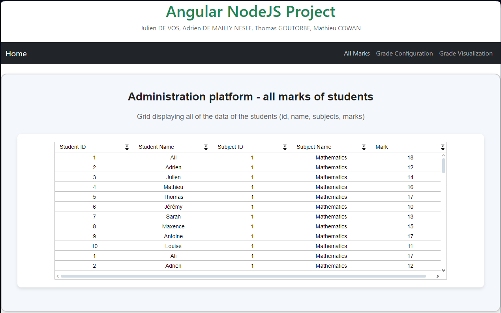
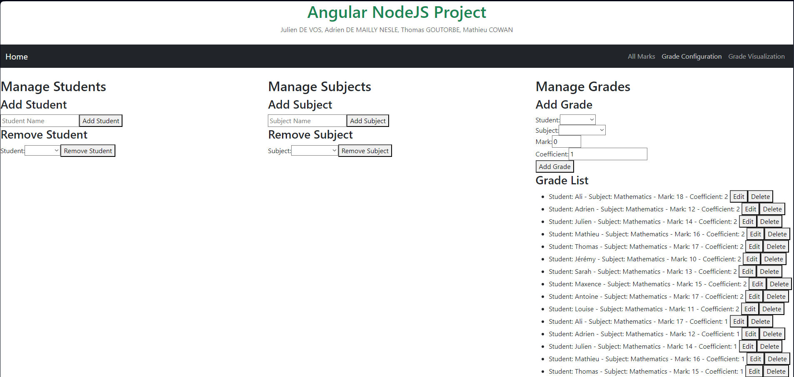
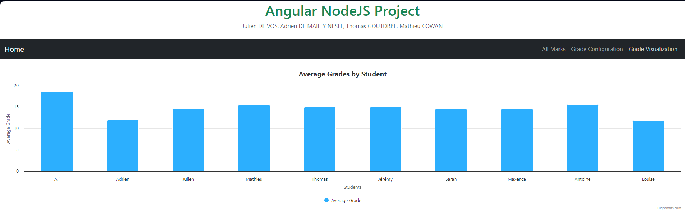
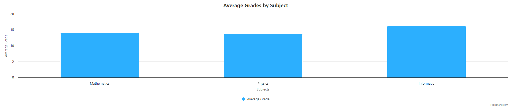
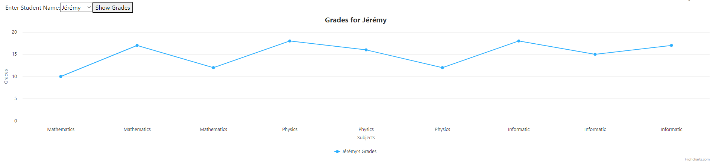

# Node & React Final Project
Julien DE VOS, Adrien DE MAILLY NESLE, Thomas GOUTORBE, Mathieu COWAN

# Project Description

The goal of this project is to create a full-stack application that allows users to manage student grades. The application consists of two main parts: a backend server built with Node.JS and Express, and a frontend client built with Angular.

# Table of Contents

* [Explanation of the web pages](#explanation-of-the-web-pages)
  * [Home Page](#home-page)
  * [All Marks Page](#student-list-page)
  * [Grade Configuration Page](#grade-configuration-page)
  * [Grade Visualization Application](#grade-visualization-application)
* [User Guide](#user-guide)
  * [Prerequisites](#prerequisites)
  * [Create the database](#create-the-database)
  * [Run the server](#run-the-server)

# Explanation of the web pages

Each page is easily accessible from the navigation bar at the top of the page.

## Home Page

The home page shows all students in the database with their overall grade average using `ag-grid`.


## All Marks Page

The All Marks page displays all the marks of all students in the database using `ag-grid`.



## Grade Configuration Page

The Grade Configuration page allows the user to interact with the database by
- Adding/Deleting a student
- Adding/Deleting a subject
- Adding/Updating/Deleting a mark



## Grade Visualization Application

The Grade Visualization page displays three different visualizations of the data in the database using `highcharts`:

1. Average Grades by Student
2. Average Grades by Subject
3. Individual Student Grades

### 1. Average Grades by Student
This bar chart shows the average grades for all students. Each bar represents a student, and the height corresponds to their average grade across all subjects.



### 2. Average Grades by Subject
This bar chart displays the average grades for each subject. Each bar represents a subject, and the height reflects the average grade for that subject.



### 3. Individual Student Grades
This line chart allows users to visualize the grades of a specific student across different subjects. The user can enter a student name, and the chart dynamically updates to show the grades for the entered student.



# User Guide

In this section, we will explain how to run the project on your local machine.

## Prerequisites

Start by cloning the repository on your local machine:

```bash
git clone https://github.com/JulienML/angular-nodejs-project.git
```

Then, navigate to the backend folder and install the required dependencies:

```bash
cd angular-nodejs-project/backend
npm install
```

Next, navigate to the frontend folder and install the required dependencies:

```bash
cd angular-nodejs-project/frontend
npm install
```

## Create the database

In order to run the project, you need to create a PostgreSQL database. To do so, start by creating a user on pgAdming with the following credentials:

- username: `SchoolDbUser`
- password: `admin`

Then, create a database named `SchoolDb` and grant all privileges to the user `SchoolDbUser`.

The database will be automatically populated with some sample data when you run the server.

## Run the server

To run the server, navigate to the backend folder and run the following command:

```bash
npm start
```

This will start the server on `http://localhost:3000`.
The Swagger API documentation is available at `http://localhost:3000/docs`.

To run the frontend, navigate to the frontend folder and run the following command:

```bash
ng serve
```

This will start the frontend on `http://localhost:4200`.