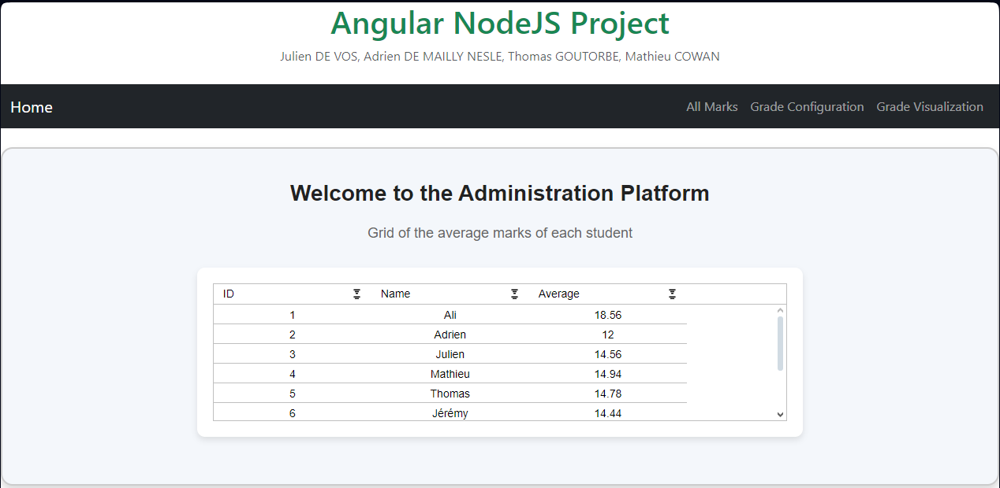

# Node & React Final Project
Julien DE VOS, Adrien DE MAILLY NESLE, Thomas GOUTORBE, Mathieu COWAN

# Project Description

The goal of this project is to create a full-stack application that allows users to manage student grades. The application consists of two main parts: a backend server built with Node.JS and Express, and a frontend client built with Angular.

# Table of Contents

* [Explanation of the web pages](#explanation-of-the-web-pages)
  * [Home Page](#home-page)
  * [All Marks Page](#student-list-page)
  * [Grade Configuration Page](#grade-configuration-page)
  * [Grade Visualization Application](#grade-visualization-application)
* [User Guide](#user-guide)
  * [Prerequisites](#prerequisites)
  * [Create the database](#create-the-database)
  * [Run the server](#run-the-server)

# Explanation of the web pages

Each page is easily accessible from the navigation bar at the top of the page.

## Home Page

The home page shows all students in the database with their overall grade average using `ag-grid`.



When you arrive the Home Page, you will see the navigation grid (black band) with "Home" and all of the other pages.

Obviously, you arrive automatically on the Home page, but you can always click on "Home" when you are on another page to go back to it.
What you see here is an ag-grid with the ID and the name of each student of the database with their average mark, which means the average of all of their marks.
When your cursor is on the grid you can always scroll to see all of the remaining rows.

### Sorting
With ag-grid it is possible to sort the data on the grid. You do that by clicking on the feature you wish to sort by. 
For instance, if you click a first time on the feature (title of column) "ID" or any numerical feature, you will see an up-arrow next to the name of columnwhich means that you can see now the data ordered by ID in ascending order, if you click again you will see a down-arrow which means that you can see now the data ordered by ID in descending order. If you click a final time, the sorting will be back to the initial sorting of the data.
For features which are categorical data (letters), for instance Name, you can do the same thing, it will be by alphabetical order.
See the following image  for example of filtering by ascending order, it is the same principle for descending order
Sorting cannot be done simulanously with multiple features

//

### Filtering
With ag-grid it is also possible to filter the data on the grid. You do that by clicking on the icon which is on the top left of the column which interests you (at the level of the title of the column), then you will have two sorts of filtering:

#### Filtering on numerical data
You can filter by the following functions : equal, does not equal, greater than, greater than or equal to, less than, less than or equal to, between, blank, not blank.
You choose one function to do your filtering than then you enter your argument (example for ID : lower than 5)

//

once you enter your argument, you can choose or not to do a AND or a OR with another function (example for ID : lower than 5 OR equal 8 - aggrid_image4)

#### Filtering on categorical data (letters)
You can filter by the following functions : Contains, Does not contain, Equals, Does not equal, Begins with, Ends with, Blank, Not Blank.
You choose one function to do your filtering than then you enter your argument (example for Name : Contains o)

//

once you enter your argument, you can choose or not to do a AND or a OR with another function (example for Name : Contains o AND equals Begins with L)
You can also do simultaneous filtering on multiple features, and you can also do one sorting simultaneously to your filtering

//


## All Marks Page

The All Marks page displays all the marks of all students in the database using `ag-grid`.


What you see here is an ag-grid with, for each mark of the database, the corresponding Student ID, Student Name, Subject ID, Subject Name and Mark Value
The principle of filtering and sorting of the data is exactly the same as in the Home Page, it is simply more interesting here since we have more rows and columns in the ag-grid.


## Grade Configuration Page

The Grade Configuration page allows the user to interact with the database by
- Adding/Deleting a student
- Adding/Deleting a subject
- Adding/Updating/Deleting a mark


## Grade Visualization Application

The Grade Visualization page displays three different visualizations of the data in the database using `highcharts`:

1. Average Grades by Student
2. Average Grades by Subject
3. Individual Student Grades

### 1. Average Grades by Student
This bar chart shows the average grades for all students. Each bar represents a student, and the height corresponds to their average grade across all subjects.


### 2. Average Grades by Subject
This bar chart displays the average grades for each subject. Each bar represents a subject, and the height reflects the average grade for that subject.


### 3. Individual Student Grades
This line chart allows users to visualize the grades of a specific student across different subjects. The user can enter a student name, and the chart dynamically updates to show the grades for the entered student.


# User Guide

In this section, we will explain how to run the project on your local machine.

## Prerequisites

Start by cloning the repository on your local machine:

```bash
git clone https://github.com/JulienML/angular-nodejs-project.git
```

Then, navigate to the backend folder and install the required dependencies:

```bash
cd angular-nodejs-project/backend
npm install
```

Next, navigate to the frontend folder and install the required dependencies:

```bash
cd angular-nodejs-project/frontend
npm install
```

## Create the database

In order to run the project, you need to create a PostgreSQL database. To do so, start by creating a user on pgAdmin with the following credentials:

- username: `SchoolDbUser`
- password: `admin`

Make sure that the option `Can login?` is enabled.

Then, create a database named `SchoolDb` owned by `SchoolDbUser`.

The database will be automatically populated with some sample data when you run the server.

## Run the server

To run the server, navigate to the backend folder and run the following command:

```bash
npm start
```

This will start the server on `http://localhost:3000`.
The Swagger API documentation is available at `http://localhost:3000/docs`.

To run the frontend, navigate to the frontend folder and run the following command:

```bash
ng serve
```

This will start the frontend on `http://localhost:4200`.
